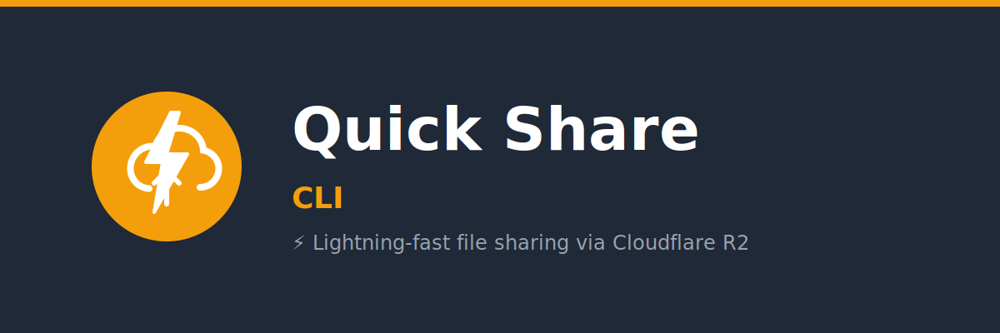

<p align="center">
  <a href="https://www.npmjs.com/package/quick-share-cli">
    
  </a>
  <a href="https://www.npmjs.com/package/quick-share-cli">
    
  </a>
  <a href="https://github.com/jack/quick-share-cli/actions">
    
  </a>
  <a href="LICENSE">
    
  </a>
</p>

<p align="center">
  <strong>⚡ Lightning-fast file sharing via Cloudflare R2</strong>
</p>

<p align="center">
  Upload any file and get instant shareable links. Supports images, videos, documents, and more.
</p>

---

## ✨ Features

- ⚡ **Lightning Fast** - Upload files instantly using rclone
- 📁 **Any File Type** - Images, videos, PDFs, archives, documents
- 🔗 **Instant Links** - Get public URLs immediately after upload
- 📋 **Smart Output** - Markdown, HTML, and embed codes auto-generated
- 🎨 **Beautiful CLI** - Colorful output with progress indicators
- 🔒 **Secure** - Credentials stored with 600 permissions
- 📱 **Cross-Platform** - macOS and Linux support
- 🚀 **Multiple Aliases** - Use `quick-share`, `qshare`, or `share`

## 📦 Installation

### Via NPM (Recommended)

```bash
npm install -g quick-share-cli
```

### Via Yarn

```bash
yarn global add quick-share-cli
```

### Via Homebrew (Coming Soon)

```bash
brew tap jack/quick-share
brew install quick-share-cli
```

### Prerequisites

You'll need [rclone](https://rclone.org/) installed:

```bash
# macOS
brew install rclone

# Linux
curl https://rclone.org/install.sh | sudo bash

# Windows (via WSL)
winget install Rclone.Rclone
```

## 🚀 Quick Start

### 1. Configure

Run the setup wizard to configure your Cloudflare R2 credentials:

```bash
quick-share setup
```

You'll need:

- Cloudflare Account ID
- R2 Access Key ID
- R2 Secret Access Key
- Bucket Name
- Public URL (e.g., `https://pub-xxxxx.r2.dev`)

**Get credentials:** Go to [Cloudflare Dashboard](https://dash.cloudflare.com/) → R2 → Manage R2 API Tokens

### 2. Upload

```bash
# Upload any file
quick-share photo.png
quick-share document.pdf
quick-share video.mp4

# Or use shortcuts
qshare archive.zip
share presentation.pptx
```

## 📖 Usage

### Basic Upload

```bash
quick-share <file>
```

### With Custom Config

```bash
quick-share upload myfile.pdf --config ./custom-config.json
```

### View Current Config

```bash
quick-share config
```

## 🎯 Examples

### Upload an Image

```bash
$ quick-share screenshot.png

Uploading screenshot.png...
✓ Upload complete!

URL:      https://pub-xxxxx.r2.dev/screenshot.png
Size:     245 KB
Type:     image/png

Markdown: 
HTML:     

✓ URL copied to clipboard
```

### Upload a Video

```bash
$ quick-share demo.mp4

Uploading demo.mp4...
✓ Upload complete!

URL:      https://pub-xxxxx.r2.dev/demo.mp4
Size:     15.2 MB
Type:     video/mp4

Video:    <video controls><source src="https://pub-xxxxx.r2.dev/demo.mp4" type="video/mp4"></video>

✓ URL copied to clipboard
```

### Upload a Document

```bash
$ quick-share report.pdf

Uploading report.pdf...
✓ Upload complete!

URL:      https://pub-xxxxx.r2.dev/report.pdf
Size:     2.4 MB
Type:     application/pdf

✓ URL copied to clipboard
```

## 🔧 Configuration

Configuration is stored securely in `~/.quick-share/config.json` with 600 permissions.

### Configuration File Format

```json
{
  "accountId": "your-account-id",
  "accessKeyId": "your-access-key-id",
  "secretAccessKey": "your-secret-access-key",
  "bucketName": "my-bucket",
  "publicUrl": "https://pub-xxxxx.r2.dev",
  "endpoint": "https://your-account-id.r2.cloudflarestorage.com"
}
```

### Multiple Buckets

You can maintain multiple configuration files for different projects:

```bash
# Personal bucket
quick-share upload photo.jpg --config ~/.quick-share/personal.json

# Work bucket
quick-share upload report.pdf --config ~/.quick-share/work.json
```

See [examples/](examples/) for more configuration examples.

## 📁 Supported File Types

| Category      | Types                                |
| ------------- | ------------------------------------ |
| **Images**    | JPG, PNG, GIF, WebP, SVG             |
| **Videos**    | MP4, MOV, WebM                       |
| **Audio**     | MP3, WAV, OGG                        |
| **Documents** | PDF, TXT, JSON, DOC, DOCX, XLS, XLSX |
| **Archives**  | ZIP, TAR, GZ                         |
| **Other**     | Any file type supported!             |

## 🛠️ Development

```bash
# Clone the repository
git clone https://github.com/jack/quick-share-cli.git
cd quick-share-cli

# Install dependencies
npm install

# Run tests
npm test

# Run linting
npm run lint
```

See [CONTRIBUTING.md](CONTRIBUTING.md) for more details.

## 📝 Changelog

See [CHANGELOG.md](CHANGELOG.md) for version history.

## 🤝 Contributing

Contributions are welcome! Please read our [Contributing Guidelines](CONTRIBUTING.md) before submitting PRs.

## 📄 License

MIT © [Jack](LICENSE)

## 🙏 Acknowledgments

- [Cloudflare R2](https://www.cloudflare.com/developer-platform/r2/) - Object storage
- [rclone](https://rclone.org/) - rsync for cloud storage
- [Commander.js](https://github.com/tj/commander.js/) - CLI framework

---

<p align="center">
  Made with ⚡ by <a href="https://github.com/jack">Jack</a>
</p>
